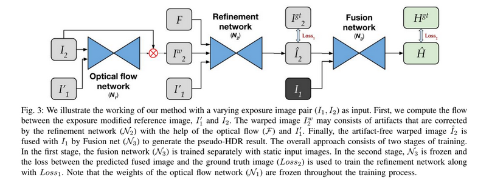

## Deep Deghosting HDR:

This Repository contains code and pretrained models for HDR version of our paper : (A Fast, Scalable, and Reliable Deghosting Method for Extreme Exposure Fusion) [Link] accepted at ICCP, 2019 .</br>
It has been tested on GTX 1080ti and RTX 20170 GPUs and tensorflow 1.13 and contains scripts for both inference and training .</br>



The project was built on Python-3.6.7 and requires following packages

* ```affine==2.2.2```
* ```matplotlib==3.0.2```
* ```numpy==1.16.2```
* ```opencv-python==4.0.0.21```
* ```Pillow==5.4.1```
* ```scikit-image==0.14.2```
* ```scikit-learn==0.20.2```
* ```scipy==1.2.1```
* ```tensorboard==1.13.1```
* ```tensorflow-gpu==1.13.1```
* ```termcolor==1.1.0```
* ```tqdm==4.31.1```


## Inference Instructions:

Use script infer.py to perform inference. The script expects : </br>
1. A directory containing set of multi-exposure shots, lebeled as 1.tif, 2.tif, 3.tif and a file exposure.txt listing out EV gaps between the images. </br>
2. Pretrained flow, refinement and fusion models.  </br>
3. The choice of fusion model: tied (works for any number of images) or untied model (fixed number of images).  </br>
4. The image to choose as reference (1st or 2nd)  </br>
5. GPU id to choose the gpu to run the script on.  </br>

### Note : </br>

1. To fit everything in single script, un-official PWC-NET implementation available here in this (repository) [https://github.com/philferriere/tfoptflow/tree/master/tfoptflow] is used, but you can use any other official implementation to precompute flows.  </br>
2. The script is meant for 3 multi-exposure shots but can easily be extended to arbitrary number of inputs along similar lines.  </br>


### Sample Command:
```
python infer.py --source\_dir test\_set --fusion\_model tied --ref\_label 2 --gpu 1
```

## Training Instructions:

* Script train\_refine.py trains refinement model. </br>


### Description of inputs to the script: 

1. train\_patch\_list : list of training images. Download them from (Link to be updated soon). Use a pretrained flow algorithm to precompute flow as numpy files and save them as flow\_21.npy and flow\_23.npy. Refer to file refine\_train.txt and directory refine\_data for sample </br>
2. val\_patch\_list : list of test images organized similarly. </br>
3. logdir : checkpoints and tensorboard visualizations get logged here. </br>
4. iters : number of iterations to train model for. </br>
5. image\_dim : dimensions of input patch during training  </br>
6. batch_size : ---do---- </br>
7. restore : 0 to start afresh, 1 to load checkpoint </br>
8. restore_ckpt: if restore was 1, path to checkpoint to load </br>
9. gpu : GPU id of the device to use for training. </br>


* Script train\_static\_fusion.py trains fusion model. </br>

### Description of inputs to the script: 

Note: Use pretrained refinement model to generate static version of training images  </br>

1. train\_patch\_idx : list of training images. Download them from (here) [http://cseweb.ucsd.edu/~viscomp/projects/SIG17HDR/]. Refer to file fusion\_train.txt and directory fusion\_data for sample. </br>
2. test\_patch\_idx : list of test images. </br>
3. fusion\_model : choose between untied and tied fusion model. </br>
4. logdir :  checkpoints and tensorboard visualizations get logged here. </br>
5. iters : number of iterations to train model for. </br>
6. lr : initial learning rate
7. image\_dim : dimensions of input patch during training  </br>
8. batch_size : ---do---- </br>
9. restore : 0 to start afresh, 1 to load checkpoint </br>
10. restore_ckpt: if restore was 1, path to checkpoint to load </br>
11. gpu : GPU id of the device to use for training. </br>
12. hdr : set 1 if you want to concatenate corresponding hdr with inputs ldrs </br>
13. hdr_weight : weight to mse loss between tonemapped hdr outputs. </br>
14. ssim_weight : weight for MS-SSIM loss </br>
15. perceptual_weight: Weight for perceptual loss </br>
